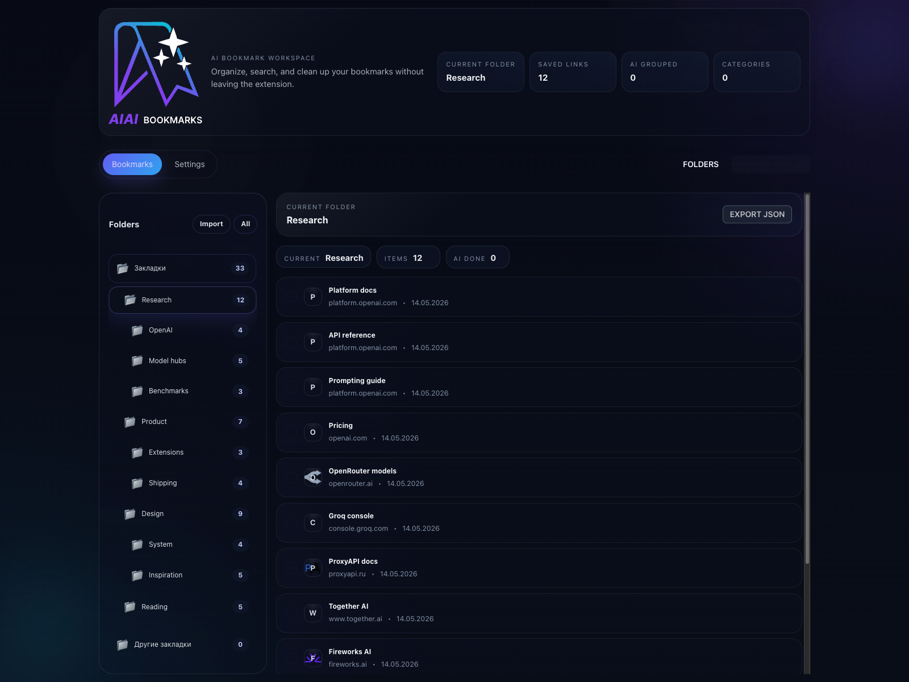
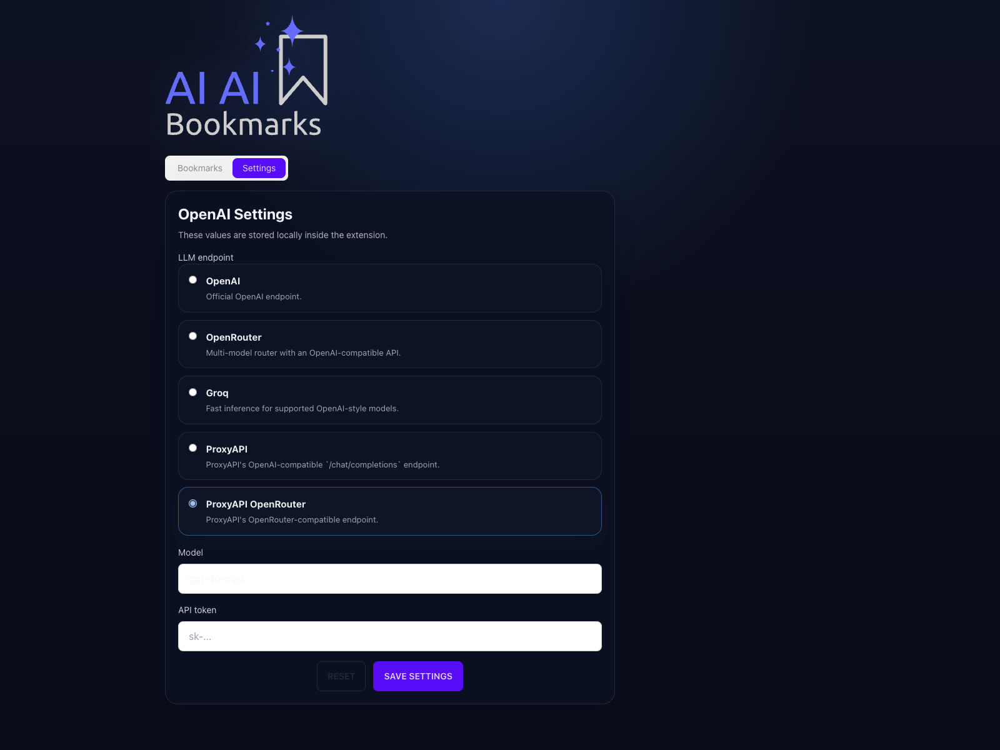

# AI AI Bookmarks

<p align="center">
  <a href="https://github.com/redzumi/ai-ai-bookmarks">
    
  </a>
</p>

<p align="center">
  Chrome extension for managing bookmarks with AI-assisted categorization and OpenAI-compatible endpoints.
</p>

<p align="center">
  
</p>

## What it does

- Browse the Chrome bookmark tree in a focused workspace without leaving the extension.
- Work with folders and nested subfolders using a sidebar that keeps the current path visible.
- Export any folder as JSON for backup, migration, or sharing.
- Import bookmark JSON back into the selected folder or into the current workspace.
- Send bookmark batches to an AI endpoint for categorization.
- Store settings locally inside the extension instead of relying on a remote account.
- Switch between OpenAI-compatible providers without changing the app logic.

## Features

- Folder workspace: move through root folders and nested folders with a single navigation view.
- Bookmark lists: see titles, hosts, and added dates in a compact, readable layout.
- Import/export: save a folder as JSON or restore a JSON export later.
- AI handling: send bookmarks to a configured model endpoint for automated categorization.
- Local settings: keep your endpoint, model, and API token inside Chrome storage.
- Safe permissions: the extension does not request `<all_urls>` access.
- Provider presets: choose from supported OpenAI-compatible endpoints instead of typing raw URLs.

## Supported endpoints

The extension currently includes presets for:

- OpenAI
- OpenRouter
- Groq
- ProxyAPI OpenAI-compatible endpoint
- ProxyAPI OpenRouter-compatible endpoint

If you want to add another compatible provider, update [`src/settings/openai.ts`](src/settings/openai.ts).

## Quick Start

1. Install dependencies:

```bash
npm install
```

2. Build the extension:

```bash
npm run build
```

3. Open `chrome://extensions`
4. Enable Developer mode
5. Click `Load unpacked`
6. Select the generated `dist` folder

## Development

- `npm run dev` - start Vite in development mode
- `npm run build` - type-check and build the extension
- `npm run lint` - run ESLint
- `npm run screenshots` - capture real UI screenshots from a local Chrome/Chromium session
- `npm run preview:screenshots` - generate preview screenshots in `docs/assets/preview`
- `npm run preview` - preview the production build

## Screenshots

<p align="center">
  
</p>

<p align="center">
  
</p>

Preview images are generated separately with `npm run preview:screenshots` and written to `docs/assets/preview`.

## How to use

1. Open the extension.
2. Go to `Settings`.
3. Pick a compatible endpoint.
4. Set the model name and API token.
5. Save the settings.
6. Return to `Bookmarks` to manage folders and entries.

## Privacy

- Settings are stored locally in the extension.
- Requests go directly to the selected provider endpoint.
- The app does not require `<all_urls>` access.

## Status

- [x] Stage 0: Hypothesis testing
- [ ] Stage 1: Basic functionality

## Notes

- The UI uses a local settings page inside the extension.
- Endpoint presets live in [`src/settings/openai.ts`](src/settings/openai.ts).
- Bookmark handling logic lives in [`src/manager/Manager.ts`](src/manager/Manager.ts).

## License

MIT
